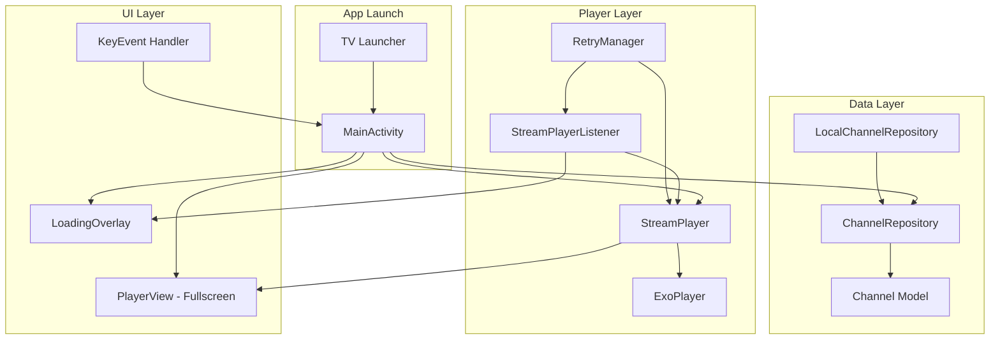

# NMTV - Android TV HLS Streaming App - Architecture Plan

## Overview

A minimalist Android TV application that launches directly into fullscreen video playback of an HLS stream. The app prioritizes simplicity, reliability, and extensibility for future channel additions.

## Requirements Summary

| Requirement | Solution |
|-------------|----------|
| Fullscreen HLS Playback | ExoPlayer with HLS extension |
| No Navigation UI | Single Activity, immediate playback |
| TV Remote Controls | KeyEvent handling for D-pad |
| Loading Indicator | ProgressBar overlay |
| Error Handling | ExoPlayer error listeners + retry logic |
| Reconnection Logic | Exponential backoff retry mechanism |
| Future Channel Support | Repository pattern with Channel model |
| Google Play TV Requirements | Leanback, banner, intent-filter |

## Design Decisions

Based on requirements review:
- **On-screen controls**: Show minimal controls only when paused (play button overlay)
- **Background/resume behavior**: Always restart stream on resume (live stream, no seeking)
- **App name**: NMTV

## Project Structure

```
app/
├── src/
│   ├── main/
│   │   ├── java/com/nmtv/app/
│   │   │   ├── TvStreamApp.kt                 # Application class
│   │   │   ├── MainActivity.kt                # Single activity - video playback
│   │   │   ├── data/
│   │   │   │   ├── model/
│   │   │   │   │   └── Channel.kt             # Channel data class
│   │   │   │   └── repository/
│   │   │   │       ├── ChannelRepository.kt   # Channel data source interface
│   │   │   │       └── LocalChannelRepository.kt # Hardcoded channels impl
│   │   │   ├── player/
│   │   │   │   ├── StreamPlayer.kt            # ExoPlayer wrapper
│   │   │   │   ├── StreamPlayerListener.kt   # Player state callbacks
│   │   │   │   └── RetryManager.kt           # Reconnection logic
│   │   │   └── ui/
│   │   │       ├── LoadingOverlay.kt          # Loading indicator component
│   │   │       └── PauseOverlay.kt            # Pause state with play button
│   │   ├── res/
│   │   │   ├── drawable/
│   │   │   │   └── app_banner.png            # TV launcher banner (320x180)
│   │   │   ├── layout/
│   │   │   │   └── activity_main.xml         # Fullscreen player layout
│   │   │   ├── mipmap/
│   │   │   │   └── ic_launcher.png           # App icon
│   │   │   └── values/
│   │   │       ├── strings.xml
│   │   │       ├── colors.xml
│   │   │       └── styles.xml
│   │   └── AndroidManifest.xml
│   └── test/
│       └── java/com/tvapp/stream/
│           └── ...                            # Unit tests
├── build.gradle.kts                          # App module build config
├── proguard-rules.pro                        # ProGuard configuration
└── ...
build.gradle.kts                              # Project-level build config
settings.gradle.kts                           # Project settings
gradle.properties                             # Gradle properties
local.properties                              # Local SDK path (auto-generated)
```

## Architecture Diagram



## Component Details

### Package Structure

All source files use the package: `com.nmtv.app`

### 1. Channel Model & Repository

**Purpose**: Enable easy addition of channels without modifying playback logic.

```kotlin
// Channel.kt
data class Channel(
    val id: String,
    val name: String,
    val streamUrl: String,
    val isDefault: Boolean = false
)

// ChannelRepository.kt
interface ChannelRepository {
    fun getDefaultChannel(): Channel
    fun getChannelById(id: String): Channel?
    fun getAllChannels(): List<Channel>
    fun getNextChannel(currentId: String): Channel?
    fun getPreviousChannel(currentId: String): Channel?
}
```

**Future Extensibility**: To add a second channel, simply add it to `LocalChannelRepository`. The `getNextChannel`/`getPreviousChannel` methods enable channel up/down navigation with D-pad.

### 2. StreamPlayer (ExoPlayer Wrapper)

**Purpose**: Encapsulate all ExoPlayer logic with clean interface.

```kotlin
class StreamPlayer(
    private val context: Context,
    private val playerView: PlayerView
) {
    private var exoPlayer: ExoPlayer? = null
    private var listener: StreamPlayerListener? = null
    
    fun initialize()
    fun play(streamUrl: String)
    fun pause()
    fun resume()
    fun release()
    fun setListener(listener: StreamPlayerListener)
}
```

**Key Features**:
- HLS media source factory
- Adaptive bitrate streaming
- Audio focus handling
- Wake lock for continuous playback

### 3. RetryManager

**Purpose**: Handle stream interruptions with exponential backoff.

```kotlin
class RetryManager(
    private val maxRetries: Int = 5,
    private val initialDelayMs: Long = 1000,
    private val maxDelayMs: Long = 30000
) {
    fun scheduleRetry(attempt: Int, action: () -> Unit)
    fun reset()
    fun cancel()
}
```

**Retry Strategy**:
- Initial delay: 1 second
- Exponential backoff: 1s → 2s → 4s → 8s → 16s (capped at 30s)
- Max retries: 5 attempts
- Network change listener to trigger immediate retry

### 4. StreamPlayerListener

**Purpose**: Communicate player state to UI.

```kotlin
interface StreamPlayerListener {
    fun onBuffering()
    fun onPlaying()
    fun onError(error: PlaybackException)
    fun onEnded()
}
```

### 5. MainActivity

**Purpose**: Single activity handling all UI and user input.

**Lifecycle**:


**Remote Control Handling**:

| Key | Action |
|-----|--------|
| DPAD_CENTER / MEDIA_PLAY_PAUSE | Toggle play/pause |
| BACK | Exit app |
| DPAD_UP | Future: Channel up |
| DPAD_DOWN | Future: Channel down |

### 6. LoadingOverlay

**Purpose**: Visual feedback during buffering.

Simple centered `ProgressBar` with semi-transparent background, shown/hidden based on `StreamPlayerListener` callbacks.

### 7. PauseOverlay

**Purpose**: Show minimal controls when paused.

- Centered play button icon
- Semi-transparent dark background
- Visible only when paused
- DPAD_CENTER or MEDIA_PLAY_PAUSE resumes playback

## Dependencies

```kotlin
// build.gradle.kts (app module)
dependencies {
    // Android TV / Leanback
    implementation("androidx.leanback:leanback:1.0.0")
    
    // ExoPlayer
    implementation("androidx.media3:media3-exoplayer:1.2.1")
    implementation("androidx.media3:media3-exoplayer-hls:1.2.1")
    implementation("androidx.media3:media3-ui:1.2.1")
    
    // Core Android
    implementation("androidx.core:core-ktx:1.12.0")
    implementation("androidx.appcompat:appcompat:1.6.1")
    
    // Lifecycle
    implementation("androidx.lifecycle:lifecycle-runtime-ktx:2.7.0")
}
```

## AndroidManifest Configuration

Key configurations for TV launcher integration:

```xml
<manifest>
    <!-- TV Feature declarations -->
    <uses-feature android:name="android.software.leanback" android:required="true" />
    <uses-feature android:name="android.hardware.touchscreen" android:required="false" />
    
    <!-- Permissions -->
    <uses-permission android:name="android.permission.INTERNET" />
    <uses-permission android:name="android.permission.WAKE_LOCK" />
    
    <application
        android:banner="@drawable/app_banner"
        android:theme="@style/Theme.TvStream">
        
        <activity
            android:name=".MainActivity"
            android:exported="true"
            android:screenOrientation="landscape"
            android:configChanges="orientation|screenSize|keyboardHidden">
            
            <!-- TV Launcher intent filter -->
            <intent-filter>
                <action android:name="android.intent.action.MAIN" />
                <category android:name="android.intent.category.LEANBACK_LAUNCHER" />
            </intent-filter>
        </activity>
    </application>
</manifest>
```

## Error Handling Strategy


## Google Play TV Requirements Checklist

- [x] Leanback library dependency
- [x] `LEANBACK_LAUNCHER` intent filter
- [x] TV banner (320x180 dp)
- [x] No touchscreen requirement (`android:required="false"`)
- [x] D-pad navigation support
- [x] Landscape orientation
- [x] No mobile-only features required

## Stream Configuration

**App Name**: NMTV

**Primary Stream (Channel 1)**:
- Name: NMTV UK
- URL: `https://cdn3.wowza.com/5/L1Uzd2FrbVlLRG1W/live/smil:nmtvuk.smil/playlist.m3u8`
- Type: HLS (HTTP Live Streaming)
- Adaptive: Yes (SMIL playlist)
- Default: Yes

## Future Enhancements

1. **Add Second Channel**: 
   - Add channel to `LocalChannelRepository`
   - D-pad up/down already wired for channel switching

2. **Channel Overlay**:
   - Brief channel info display on switch
   - Auto-hide after 3 seconds

3. **Settings**:
   - Stream quality preference
   - Auto-retry toggle

## File Implementation Order

1. `build.gradle.kts` (project) - Project configuration
2. `settings.gradle.kts` - Module settings
3. `app/build.gradle.kts` - App dependencies
4. `AndroidManifest.xml` - TV configuration
5. `Channel.kt` - Data model
6. `ChannelRepository.kt` - Interface
7. `LocalChannelRepository.kt` - Implementation
8. `StreamPlayerListener.kt` - Callback interface
9. `RetryManager.kt` - Retry logic
10. `StreamPlayer.kt` - ExoPlayer wrapper
11. `activity_main.xml` - Layout
12. `MainActivity.kt` - Main activity
13. Resource files (strings, colors, styles)
14. ProGuard rules
15. App banner and icons

---

## Implementation Ready

The architecture is finalized and ready for implementation in Code mode.